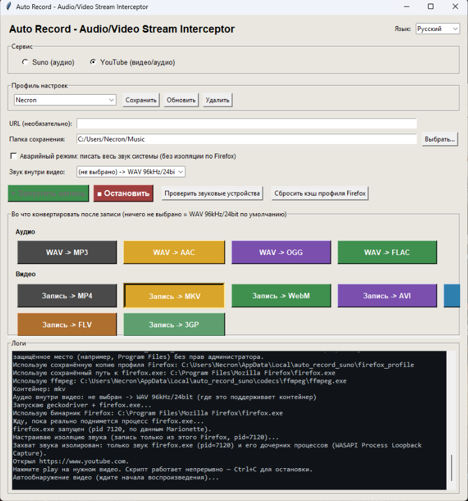
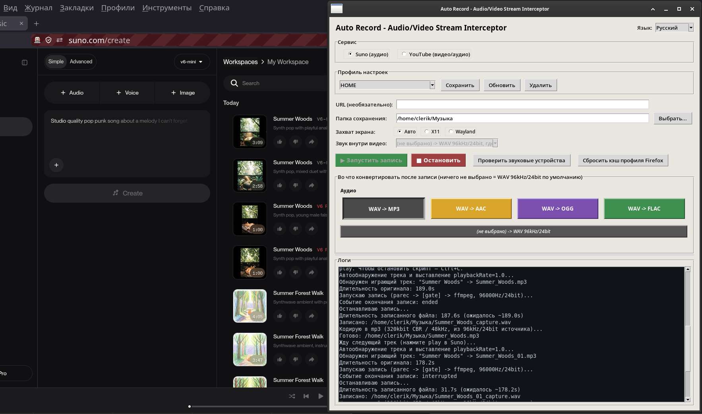

# Auto Record — Audio/Video Stream Interceptor

Automated recorder for **Suno** tracks and **YouTube** audio/video, using a dedicated isolated Firefox instance to capture only the selected browser's audio and, for video, its screen output.

**GUI + CLI · Linux (PulseAudio) · Windows (WASAPI)**

**Audio:** MP3 · AAC · OGG · FLAC  
**Video:** MP4 · MKV · WebM · AVI · MOV · FLV · 3GP
 

  

  

  

 
Donate $5 to buy food for a cat:
 
USDT(TRC20): TWEmMHfc5DbQuDru8oaXNoXxTNkqYJbsYv 
BTC(BEP20): 0x147d19ae0e1b50ca6c87d32b2f716068e6ba5b17 
SOL(SOL): j3kkX7VuKfchcnH8Y9bUCbqjjA4ssLpspvsw4YZi8ia 
